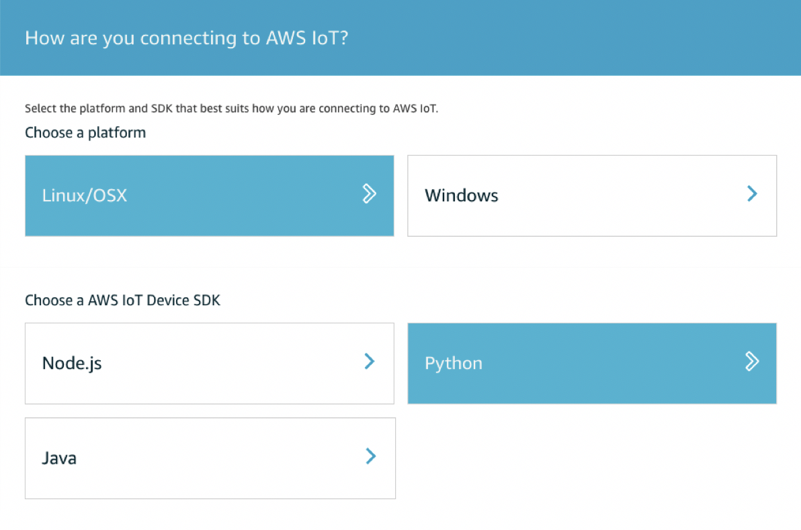

# Guidance Document for WSU LAR AQ Device Connectivity to Urbanova Cloud / AWS IoT

Jon Thompson  
July 3, 2018  
(Adapted to Markdown by Von P. Walden (WSU) on 20 Dec 2018)

## IoT Device Configuration and Registration

Because the Urbanova Cloud user interface console is still in design and develop phase, we will use the native AWS console and workflow (WSU account) to provision IoT services for WSU LAR.

The first step is to <font color="green">Onboard a Device</font>:

1.	From the AWS Console (WSU Account) select IoT Core
2.	Choose <font color="green">Onboard</font> from the left panel menu
3.	Choose <font color="green">Configuring a Device</font>
4.	Select Next to start the configuration workflow
5.	Choose the device local environment settings and select next:

6. Provide a name for your device and select Next
7. Download the <font color="green">Connection Kit</font>

&nbsp;&nbsp;&nbsp;&nbsp;The following resources are created when you download the Connection Kit:
	
*	A thing in the AWS Device Registry
*	A policy record to send and receive messages

&nbsp;&nbsp;&nbsp;&nbsp;The Connection Kit includes the following artifacts:

*	A certificate and public private key pair
*	A script to download a root certificate from Semantic and to download the AWS IoT Device SDK if not installed, and a test application to send and receive messages

## Device Local Configuration and IoT Connectivity

1.	Install <font color="green">Prerequisites</font>:
 
 &nbsp;&nbsp;&nbsp;&nbsp;The device must have the following perquisites install prior to executing the install script from AWS:
 
 *	**Python** (assuming that Python was selected for SDK)
 *	**Git**
 
 &nbsp;&nbsp;&nbsp;&nbsp;&nbsp;&nbsp;&nbsp;&nbsp;Use the Advanced Package Tool to install the latest version of Git:
 
 ```
 df -h								# Validate Disk Space
 
 sudo apt-get update				# Update latest package information
 
 sudo apt-get dist-upgrade			# Upgrade Package Installed Dependencies
 
 sudo apt-get install git			# Install git
 
 sudo apt-get clean					# Remove APT Archive Package Files
 ```
  
 * **Internet access on port 8883** - The standard port for using MQTT of SSL is port 8883.

2.	Copy the <font color="green">Connection Kit</font> from local computer to your device (command below is just an example of using SCP from unix-based computer):
 
 ```
 scp ~/Downloads/connect_device_package.zip pi@xxx.xxx.xxx:~/urbanova/iot
 ```
  
3.	Unzip the <font color="green">Connection Kit</font> on the device
 
 ```
 ssh pi@xxx.xxx.xxx
 
 cd ~/urbanova/iot
 
 unzip connect_device_package.zip
```

4. Add execution permissions
 
 ```
 chmod +x start.sh
 ```

5. Run the start script
 
 ```
 sudo ./start.sh
 ```
 
 The script will download and install a Root Certificate from Semantic and the AWS IoT SDK if not already installed, and start the test application.  The test application increments a counter and sends the counter value to AWS IoT Core once per second.

## IoT Device Connectivity Testing

The <font color="green">start.sh</font> executes the example application located at <font color="green">aws-iot-device-sdk-python/samples/basicPubSub/basicPubSub.py</font> uses the default messages topic “<font color="green">sdk/test/Python</font>” to send messages from the device.

The example application is a good starting point to develop your IoT endpoint messaging architecture.  It is worth taking a look at the source code for this file.  The source code is only 125 lines.

We will now test that messages from the device can be securely subscribed and received from Urbanova Cloud / AWS IoT:

1.	From <font color="green">IoT Core</font> select <font color="green">Test</font> from the left menu panel
2.	Select Subscribe to a <font color="green">Topic</font>
3.	In the Subscription topic text box enter “<font color="green">sdk/test/Python</font>”
4.	Click Subscribe and view results below (make sure endpoint application is running)

